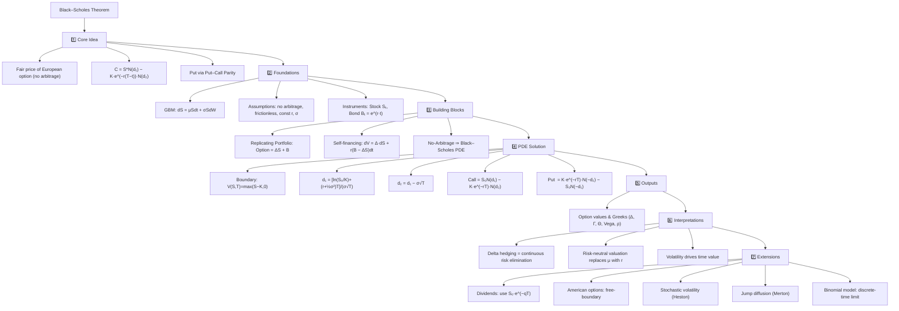

# mindmap



---

```
Black–Scholes Theorem
├── 1️⃣ Core Idea
│   ├── Fair price of European option (no arbitrage)
│   ├── C = S*N(d₁) − K·e^(−r(T−t))·N(d₂)
│   └── Put via Put–Call Parity
├── 2️⃣ Foundations
│   ├── GBM: dS = μSdt + σSdW
│   ├── Assumptions: no arbitrage, frictionless, const r, σ
│   └── Instruments: Stock Sₜ, Bond Bₜ = e^(r·t)
├── 3️⃣ Building Blocks
│   ├── Replicating Portfolio: Option = ΔS + B
│   ├── Self-financing: dV = Δ·dS + r(B − ΔS)dt
│   └── No-Arbitrage ⇒ Black–Scholes PDE
├── 4️⃣ PDE Solution
│   ├── Boundary: V(S,T)=max(S−K,0)
│   ├── d₁ = [ln(S₀/K)+(r+½σ²)T]/(σ√T)
│   ├── d₂ = d₁ − σ√T
│   ├── Call = S₀N(d₁) − K·e^(−rT)·N(d₂)
│   └── Put  = K·e^(−rT)·N(−d₂) − S₀N(−d₁)
├── 5️⃣ Outputs
│   └── Option values & Greeks (Δ, Γ, Θ, Vega, ρ)
├── 6️⃣ Interpretations
│   ├── Delta hedging = continuous risk elimination
│   ├── Risk-neutral valuation replaces μ with r
│   └── Volatility drives time value
└── 7️⃣ Extensions
    ├── Dividends: use S₀·e^(−qT)
    ├── American options: free-boundary
    ├── Stochastic volatility (Heston)
    ├── Jump diffusion (Merton)
    └── Binomial model: discrete-time limit
```
