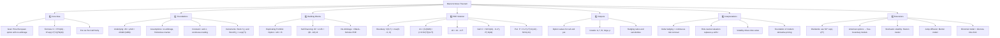

# mindmap

```mermaid

graph TB
  A["Black-Scholes Theorem"]

  A --> B1["1️⃣ Core Idea"]
  A --> B2["2️⃣ Foundations"]
  A --> B3["3️⃣ Building Blocks"]
  A --> B4["4️⃣ PDE Solution"]
  A --> B5["5️⃣ Outputs"]
  A --> B6["6️⃣ Interpretations"]
  A --> B7["7️⃣ Extensions"]

  %% Core Idea
  B1 --> C1["Goal: Price European option with no arbitrage"]
  B1 --> C2["Formula: C = S*N(d1) - K*exp(-r*(T-t))*N(d2)"]
  B1 --> C3["Put via Put-Call Parity"]

  %% Foundations
  B2 --> C4["Underlying: dS = μSdt + σSdW (GBM)"]
  B2 --> C5["Assumptions: no arbitrage, frictionless market"]
  B2 --> C6["Constant r and σ, continuous trading"]
  B2 --> C7["Instruments: Stock S_t and Bond B_t = exp(r*t)"]

  %% Building Blocks
  B3 --> C8["Replicating Portfolio: Option = ΔS + B"]
  B3 --> C9["Self-financing: dV = Δ dS + r(B - ΔS) dt"]
  B3 --> C10["No-Arbitrage ⇒ Black–Scholes PDE"]

  %% PDE Solution
  B4 --> C11["Boundary: V(S,T) = max(S - K, 0)"]
  B4 --> C12["d1 = [ln(S0/K)+(r+0.5σ²)T]/(σ√T)"]
  B4 --> C13["d2 = d1 - σ√T"]
  B4 --> C14["Call: C = S0 N(d1) - K e^{-rT} N(d2)"]
  B4 --> C15["Put:  P = K e^{-rT} N(-d2) - S0 N(-d1)"]

  %% Outputs
  B5 --> C16["Option values for call and put"]
  B5 --> C17["Greeks: Δ, Γ, Θ, Vega, ρ"]
  B5 --> C18["Hedging ratios and sensitivities"]

  %% Interpretations
  B6 --> C19["Delta hedging = continuous risk removal"]
  B6 --> C20["Risk-neutral valuation replaces μ with r"]
  B6 --> C21["Volatility drives time value"]
  B6 --> C22["Foundation of modern derivative pricing"]

  %% Extensions
  B7 --> C23["Dividends: use S0 * exp(-q*T)"]
  B7 --> C24["American options → free-boundary models"]
  B7 --> C25["Stochastic volatility: Heston model"]
  B7 --> C26["Jump diffusion: Merton model"]
  B7 --> C27["Binomial model = discrete-time limit"]


```
