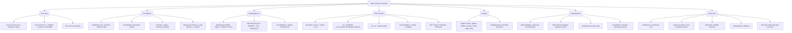

# mindmap

```mermaid

graph TD
  A[Black-Scholes Theorem] --> B1(Core Idea)
  A --> B2(Foundations)
  A --> B3(Building Blocks)
  A --> B4(PDE Solution)
  A --> B5(Outputs)
  A --> B6(Interpretations)
  A --> B7(Extensions)

  B1 --> C1["Goal: Fair price of a European option"]
  B1 --> C2["Key Formula: C = S*N(d1) - K*exp(-r*(T-t))*N(d2)"]
  B1 --> C3["Put via Put-Call Parity"]

  B2 --> C4["Underlying: dS = mu*S*dt + sigma*S*dW"]
  B2 --> C5["No arbitrage, frictionless market"]
  B2 --> C6["Constant r, sigma, continuous trading"]
  B2 --> C7["Instruments: Stock S_t and Bond B_t = exp(r*t)"]

  B3 --> C8["Replicating Portfolio: Option = Delta*S + Bond"]
  B3 --> C9["Self-Financing: dV = Delta*dS + r*(B - Delta*S)*dt"]
  B3 --> C10["No-Arbitrage => Black-Scholes PDE"]

  B4 --> C11["Boundary: V(S,T) = max(S - K, 0)"]
  B4 --> C12["d1 = [ln(S0/K)+(r+0.5*sigma^2)*T]/(sigma*sqrt(T))"]
  B4 --> C13["d2 = d1 - sigma*sqrt(T)"]
  B4 --> C14["Call: S0*N(d1) - K*exp(-r*T)*N(d2)"]
  B4 --> C15["Put: K*exp(-r*T)*N(-d2) - S0*N(-d1)"]

  B5 --> C16["Option values, Greeks (Delta, Gamma, Theta, Vega, Rho)"]
  B5 --> C17["Hedging Ratios and Risk Measures"]

  B6 --> C18["Delta Hedging: continuous risk elimination"]
  B6 --> C19["Risk-Neutral Valuation: replace mu with r"]
  B6 --> C20["Volatility drives time value"]
  B6 --> C21["Foundation of modern derivatives pricing"]

  B7 --> C22["Dividends: use S0*exp(-q*T)"]
  B7 --> C23["American options: free-boundary models"]
  B7 --> C24["Stochastic volatility (Heston)"]
  B7 --> C25["Jump diffusion (Merton)"]
  B7 --> C26["Binomial model: discrete-time limit"]


```
