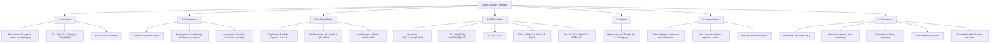

# mindmap

```mermaid

flowchart TD
    A["Black–Scholes Theorem"]

    A --> B1["1. Core Idea"]
    B1 --> B1a["Fair price of European option (no arbitrage)"]
    B1 --> B1b["C = S*N(d1) − K*exp(−r*(T−t))*N(d2)"]
    B1 --> B1c["Put via Put–Call Parity"]

    A --> B2["2. Foundations"]
    B2 --> B2a["GBM: dS = μSdt + σSdW"]
    B2 --> B2b["Assumptions: no arbitrage, frictionless, const r,σ"]
    B2 --> B2c["Instruments: Stock Sₜ, Bond Bₜ = exp(r*t)"]

    A --> B3["3. Building Blocks"]
    B3 --> B3a["Replicating Portfolio: Option = ΔS + B"]
    B3 --> B3b["Self-financing: dV = Δ dS + r(B − ΔS)dt"]
    B3 --> B3c["No-Arbitrage ⇒ Black–Scholes PDE"]

    A --> B4["4. PDE Solution"]
    B4 --> B4a["Boundary: V(S,T)=max(S−K,0)"]
    B4 --> B4b["d1 = [ln(S0/K)+(r+0.5σ²)T]/(σ√T)"]
    B4 --> B4c["d2 = d1 − σ√T"]
    B4 --> B4d["Call = S0N(d1) − K e^(−rT) N(d2)"]
    B4 --> B4e["Put  = K e^(−rT) N(−d2) − S0 N(−d1)"]

    A --> B5["5. Outputs"]
    B5 --> B5a["Option values & Greeks (Δ, Γ, Θ, Vega, ρ)"]

    A --> B6["6. Interpretations"]
    B6 --> B6a["Delta hedging = continuous risk elimination"]
    B6 --> B6b["Risk-neutral valuation replaces μ with r"]
    B6 --> B6c["Volatility drives time value"]

    A --> B7["7. Extensions"]
    B7 --> B7a["Dividends: use S0 e^(−qT)"]
    B7 --> B7b["American options: free-boundary"]
    B7 --> B7c["Stochastic volatility (Heston)"]
    B7 --> B7d["Jump diffusion (Merton)"]
    B7 --> B7e["Binomial model: discrete-time limit"]


```
