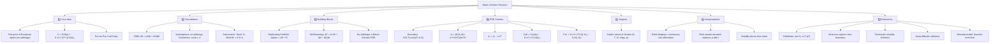

# mindmap

```mermaid

flowchart TD
    A["Black–Scholes Theorem"]

    A --> B1["1️⃣ Core Idea"]
    B1 --> B1a["Fair price of European option (no arbitrage)"]
    B1 --> B1b["C = S*N(d₁) − K·e^(−r(T−t))·N(d₂)"]
    B1 --> B1c["Put via Put–Call Parity"]

    A --> B2["2️⃣ Foundations"]
    B2 --> B2a["GBM: dS = μSdt + σSdW"]
    B2 --> B2b["Assumptions: no arbitrage, frictionless, const r, σ"]
    B2 --> B2c["Instruments: Stock Sₜ, Bond Bₜ = e^(r·t)"]

    A --> B3["3️⃣ Building Blocks"]
    B3 --> B3a["Replicating Portfolio: Option = ΔS + B"]
    B3 --> B3b["Self-financing: dV = Δ·dS + r(B − ΔS)dt"]
    B3 --> B3c["No-Arbitrage ⇒ Black–Scholes PDE"]

    A --> B4["4️⃣ PDE Solution"]
    B4 --> B4a["Boundary: V(S,T)=max(S−K,0)"]
    B4 --> B4b["d₁ = [ln(S₀/K)+(r+½σ²)T]/(σ√T)"]
    B4 --> B4c["d₂ = d₁ − σ√T"]
    B4 --> B4d["Call = S₀N(d₁) − K·e^(−rT)·N(d₂)"]
    B4 --> B4e["Put  = K·e^(−rT)·N(−d₂) − S₀N(−d₁)"]

    A --> B5["5️⃣ Outputs"]
    B5 --> B5a["Option values & Greeks (Δ, Γ, Θ, Vega, ρ)"]

    A --> B6["6️⃣ Interpretations"]
    B6 --> B6a["Delta hedging = continuous risk elimination"]
    B6 --> B6b["Risk-neutral valuation replaces μ with r"]
    B6 --> B6c["Volatility drives time value"]

    A --> B7["7️⃣ Extensions"]
    B7 --> B7a["Dividends: use S₀·e^(−qT)"]
    B7 --> B7b["American options: free-boundary"]
    B7 --> B7c["Stochastic volatility (Heston)"]
    B7 --> B7d["Jump diffusion (Merton)"]
    B7 --> B7e["Binomial model: discrete-time limit"]


```
